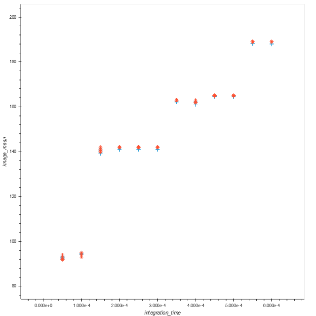

OpenCV C++ VideoCapture Utility
==========

author: P.J. Rusello
based on: https://docs.opencv.org/3.1.0/d8/dfe/classcv_1_1VideoCapture.html

Update 2019-04-01 to use a smaller OpenCV compiled for OoT.  

Installation & Building
-----------------------
The OpenCV distribution for use on the BeagleBone is available at
\\arete\shared\arlington\Engineering\Projects\OoT\5 Other\opencv-3.4.5.tar.bz2

Copy that file to the BeagleBone and place in user oot's home folder. Extract it 
with `tar -xf opencv-3.4.5.tar.bz2` (you may get warnings about files being from 
the future if the BeagleBone's date is incorrect).

Once that file is extracted, run the following command so pkg-config can populate
lib and include directories correctly.  

`sudo cp /home/oot/opencv-3.4.5/lib/pkgconfig/opencv.pc /usr/lib/arm-linux-gnueabihf/pkgconfig/`

If everything is installed correctly `cd` into `/home/oot/opencv_capture` 
and `make`. Everything should build without any issues.

Capture Usage
-------------
`capture` takes three command line arguments:
- the total capture time in seconds
- the output directory to save frames to
- the time between frames (*not* frames per second), the minimum time is 0.2 seconds
- integration time

Default values are supplied for each, so calling `./capture` will capture 30 seconds of imagery with 5 seconds between frames (6 frames total) with an integration time of 0.0001 seconds.

Based on testing with various values for this property, exposure time is reported in intervals of 0.0002 seconds (e.g. the next larger integration time is 0.0004 seconds, not 0.0003 seconds). But, setting a value like 0.0001 produces a lower overall exposure than setting 0.0002 seconds. Setting anything lower than 0.0001 doesn't seem to have much effect, and setting something in between the reported intervals (like 0.0003) also doesn't seem to have an effect. 

)

You can edit capture.cpp to turn on `YUYV` capture if you want, but it's not recommended since the USB bandwidth on the BeagleBone and STRIDR isn't super high.